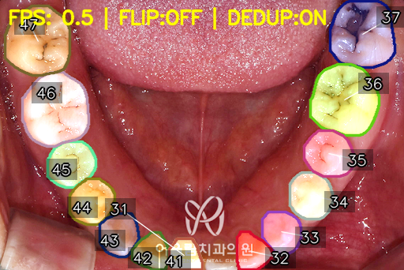
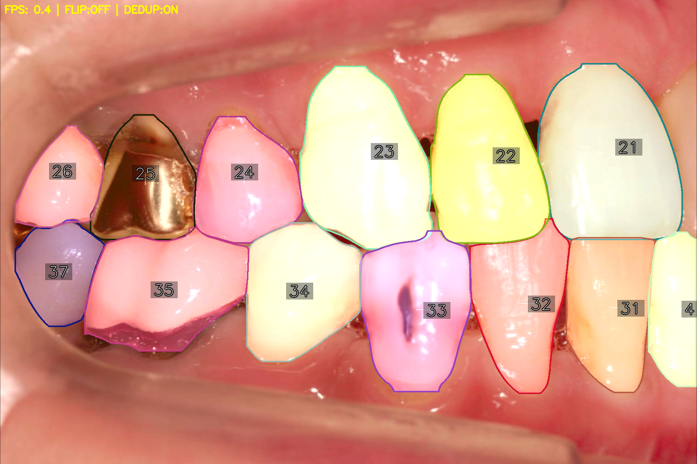
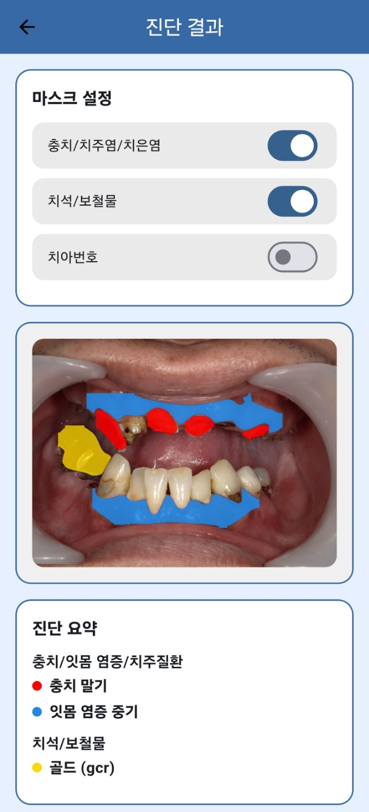
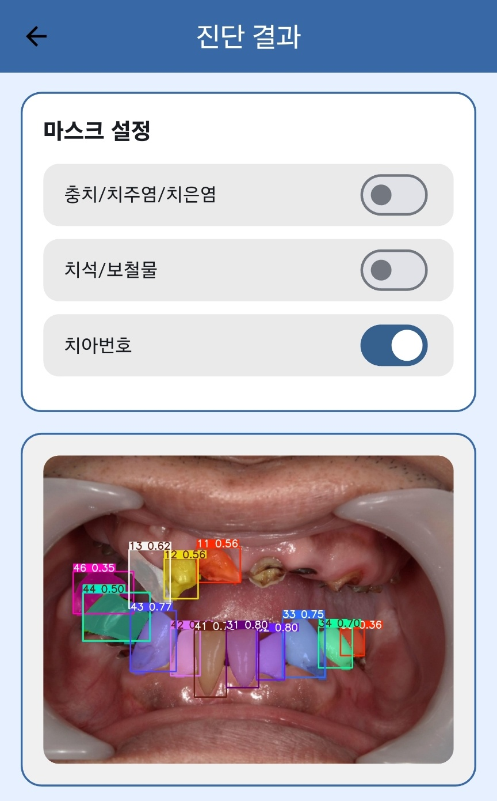
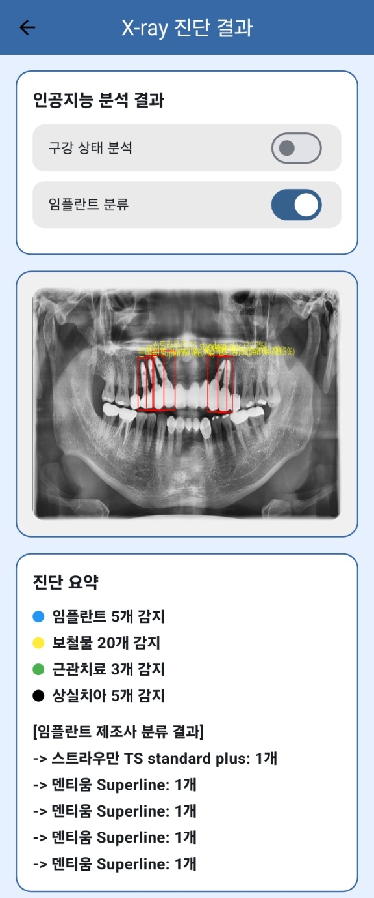
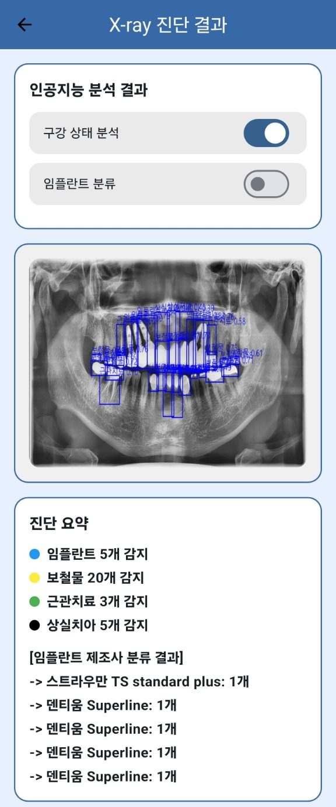

# 🤖 AI 모델 결과 모음 (AI Model Results)

이 문서는 **ToothAI 프로젝트**에서 개발된 AI 모델들의 **출력 예시**를 정리한 문서입니다.  
환자용 앱과 의사용 웹 서비스에서 실제로 활용되는 분석 결과를 시각화했습니다.  

---

## 1️⃣ 치아 번호 분할 (Tooth Numbering, FDI 체계)

| Tooth Numbering 1 | Tooth Numbering 2 |
|---|---|
|  |  |

- FDI 체계를 기반으로 **치아 고유 번호 자동 부여**  
- 추후 병변·보철물 정보를 각 치아에 연결하기 위한 **핵심 전처리 단계**  
- 실시간 환경에서도 FPS 0.4~0.5로 동작 가능  

---

## 2️⃣ 실시간 탐지 & 세그멘테이션 (Real-time Demo)

| 실시간 탐지 (Detection) | 실시간 Segmentation |
|---|---|
|  |  |

- **Detection**: 치아별 보철물/임플란트 여부를 Bounding Box로 표시  
- **Segmentation**: 병변·위생 상태를 픽셀 단위로 분리해 시각화  
- 실제 카메라 입력을 실시간으로 처리, 진료 전 AI 기반 **즉시 예측** 지원  

---

## 3️⃣ 앱 업로드 결과 (RGB 이미지 기반)

| Segmentation | Tooth Numbering |
|---|---|
|  |  |

- 사용자가 **구강 사진을 앱에 업로드** → 서버에서 AI 모델 분석 → 결과 반환  
- Segmentation: 충치, 치주질환, 치석/보철물 여부를 색상으로 구분  
- Tooth Numbering: 각 치아에 번호 매핑 → **환자 맞춤형 진단 요약 생성**  

---

## 4️⃣ X-ray 분석 결과

| Classification (임플란트 분류) | Detection (상태 분석) |
|---|---|
|  |  |

- **X-ray Classification**: 임플란트 제조사·모델 분류  
  - 예: Straumann, Dentium 등 제조사별 식별 → **보철물 관리 효율화**  
- **X-ray Detection**:  
  - 임플란트 개수  
  - 보철물 및 근관치료 치아 탐지  
  - 상실치 위치 표시  

---

## 📌 요약

이 결과물들은 모두 **환자–의사 간 진료 보조**를 위해 설계되었습니다.  
- 환자: 구강 사진/X-ray 업로드 → **즉각적인 AI 진단 요약** 확인  
- 의사: AI 결과 + 환자 데이터 기반으로 **효율적인 진단/상담 진행**  

> ToothAI의 AI 모델은 단순 탐지를 넘어, **번호 매핑 → 상태 분류 → 진단 요약**까지  
> 진료 프로세스 전체에 활용 가능한 수준으로 발전 중입니다.
